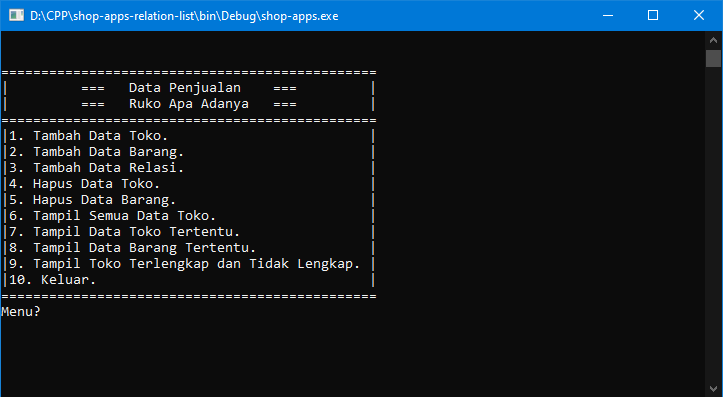
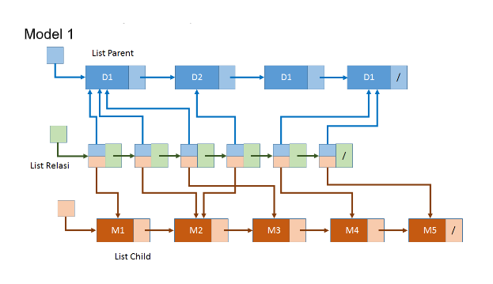

# Tugas Besar STD (Struktur Data)

## Deskripsi
Program ini merupakan tugas akhir wajib untuk syarat kelulusan untuk mata kuliah **STD** di prodi **RPL(Rekayasa Perangkat Lunak)** di telkom university. Program ini dapat melakukan:
 1. Penambahan data toko.
 2. Penambahan data barang.
 3. Penentuan relasi toko dan barang yang dijual (dan sebalikknya).
 4. Menghapus data toko.
 5. Menghapus data barang.
 6. Menampilkan data keseluruhan toko beserta data barang yang dijualnya.
 7. Menampilkan data barang yang dijual oleh toko tertentu.
 8. Menampilkan data toko menjual barang tertentu.
 9. Menampilkan data toko yang paling lengkap jualannya dan yang paling sedikit.

Program ini menggunakan model dibawah:

## How To Run
 1. Buka cmd di direktori program.
 2. Ketik `go build` di cmd.
 3. Ketik nama dari folder example: `shop-apps-relation-list` di cmd.

## Notes
Gunakan program ini sebagai referensi bukan untuk plagiarisme.